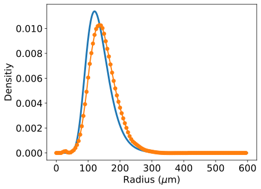
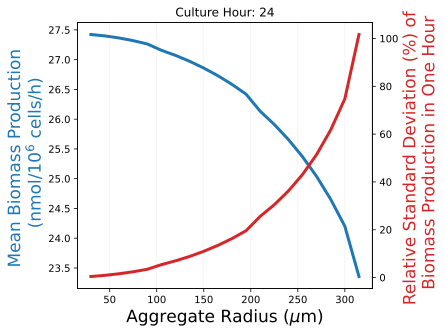
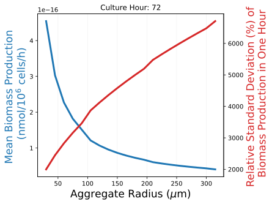
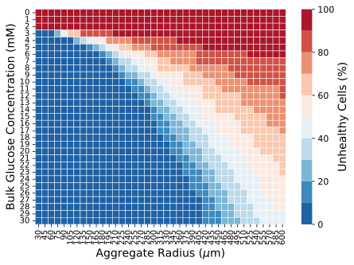
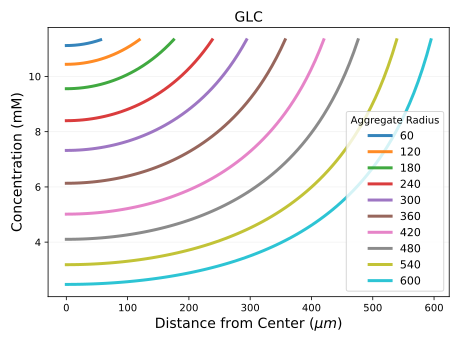
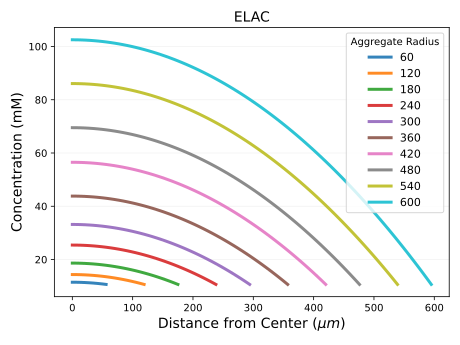

Bio-SoS: A biological system of systems based simulation framework for iPSC cultures.
===========
[](https://zhenghuazx.github.io/hua.zheng/)


Bio-SoS is a package for simulating iPSC cultures under different conditions.

Large-scale manufacturing of induced pluripotent stem cells (iPSCs) is essential for cell therapies and regenerative 
medicines. Yet, the self-aggregation iPSCs can generate large cell aggregates in suspension bioreactors, resulting in 
insufficient nutrient supply and extra metabolic waste build-up for the cells located at core. Since subtle changes in 
micro-environment can lead to cell stress and heterogeneous cell population, a novel Biological System-of-Systems 
(Bio-SoS) framework is proposed to characterize cell-to-cell interactions, spatial heterogeneity, and cell response to 
micro-environmental variation. Building on iPSC stochastic metabolic reaction network, aggregation kinetics, and 
reaction-diffusion mechanisms, the Bio-SoS model can quantify the impact of factors (i.e., aggregate size) on cell 
product health and quality heterogeneity, accounting for causal interdependencies at individual cell, aggregate, and 
cell population levels. The proposed framework can accurately predict iPSC culture conditions for both monolayer and 
aggregate cultures, where these predictions can be leveraged to ensure that the culture process follows an expected 
trajectory for successful cell growth and expansion. 

Cite Us
======================================
Zheng, H., Harcum, S.W., Pei, J. et al. Stochastic biological system-of-systems modelling for iPSC culture. Commun Biol 7, 39 (2024). https://doi.org/10.1038/s42003-023-05653-w

Installation
======================================
To create a virtual environment, decide upon a directory where you want to place it, and run the venv module as a 
script with the directory path:
```shell
python3 -m venv venv
source venv/bin/activate
```
Use pip to install all required dependencies
```shell
pip install -r requirements.txt
```
Usage
======================================
### Usage Help
the main.py script provides useful help messages that describe the available command-line arguments and their usage.
```shell
python main.py --help
```
Read the help messages to check out hyperparamters:
```shell
usage: main.py [-h] [-val VALIDATION_METABOLITE_CONSUMPTION] [-ss STEADY_STATE_CONCENTRATION_PROFILES] [-f FLUX_RATES_AND_METABOLITE_CONC] [-c COMPARISON_UNDER_MONOLAYER_CONDITION] [-v VARIANCE_COMPONENT_ANALYSIS] [-m INNER_OUTER_CELL_METABOLISM] [-ch HEALTH_CONDITION]
               [-size GET_BIOMASS_YIELD_VARIANCE_ANALYSIS] [-pbm PBM] [-r SINGLE_CELL_RADIUS] [-t TORTUOSITY] [-dt DELTA_T] [-p POROSITY]

optional arguments:
  -h, --help            show this help message and exit
  -val VALIDATION_METABOLITE_CONSUMPTION, --validation-metabolite-consumption VALIDATION_METABOLITE_CONSUMPTION
                        validation metabolite consumption.
  -ss STEADY_STATE_CONCENTRATION_PROFILES, --steady-state-concentration-profiles STEADY_STATE_CONCENTRATION_PROFILES
                        Biomass yield and variance analysis.
  -pbm PBM, --population-balance-model PBM
                        Run population balance model. PBM takes long time (about 12 hours).
  -r SINGLE_CELL_RADIUS, --single-cell-radius SINGLE_CELL_RADIUS
                        Set single cell raidus.
  -t TORTUOSITY, --tortuosity TORTUOSITY
                        Set tortuosity.
  -dt DELTA_T, --delta-t DELTA_T
                        Set simulation time interval (h)
  -p POROSITY, --porosity POROSITY
                        Set porosity
```

Example
===========
## Bio-SoS Simulation example in Python Console
```python
import pickle
from multi_scale_model.aggregate import Aggregate, get_aggregation_profile
from multi_scale_model.Util import *
# HGLL
# simulation parameters
test_index = 1
porosity = 0.27  # 0.27 at 60 rpm, and 0.229 at 100 rpm of agitation rate
cell_growth_rate = 0.043
single_cell_radius = 7.5
hours = 48
bioreactor = True
# Load PBM model for aggregation size distribution and configure the culture setting (monolayer versus bioreactor)
file = open("multi_scale_model/data/result_all.pickle", 'rb')
parameters = pickle.load(file)
parameters = parameters.params
if bioreactor:
    agg_density_function = get_aggregation_profile(no_aggregate=False, bioreactor=True) # bioreactor
else:
    agg_density_function = get_aggregation_profile(no_aggregate=True, bioreactor=False) # monolayer

# Load initial metabolite concentrations of iPSC cell culture
data_whole, mean_whole, std_whole = get_data('dynamic_model/iPSC_data.xlsx')

x0_LGHL = np.hstack([S2_0 * 1000 * mean_whole[test_index][0, -1], mean_whole[test_index][0]])
agg_simulator = Aggregate(cell_growth_rate, agg_density_function, meta_index, x0_LGHL,
                          single_cell_radius, parameters, diffusion_coef, porosity, delta_t=1)
for i in range(hours):
    agg_simulator.simulate()
    print('time', (i + 1) * 1, 'GLC', agg_simulator.extra_metabolites[meta_label_index['GLC'][1]],
          'Lac', agg_simulator.extra_metabolites[meta_label_index['ELAC'][1]])
```

The solution object is the same as class attribute `results`. We can plot the glucose concentration trajectory using matplotlib:
```python
import numpy as np
import matplotlib.pyplot as plt
from multi_scale_model.Util import meta_label_index
plt.plot(np.array(agg_simulator.results)[:hours, meta_label_index['GLC'][0]]) # plot simulated trajectory of glucose
plt.show()
```

Lactate concentration trajectory:
```python
import numpy as np
import matplotlib.pyplot as plt
from multi_scale_model.Util import meta_label_index
plt.plot(np.array(agg_simulator.results)[:hours, meta_label_index['ELAC'][0]]) # plot simulated trajectory of lactate
plt.show()
```


## Bio-SoS Result Reproduction
1(a). Generate temporal size distribution of aggregation population balance model (PBM) by using pretrained model 
(`-pretrained_pbm True`). (Fig. 2a and Fig. 2b)
```shell
python main.py -pbm True -pretrained_pbm True
```
1(b). Generate temporal size distribution of aggregation population balance model (PBM) without using pretrained model 
(`-pretrained_pbm False`). The parameter estimation can take more than 12 hours.(Fig. 2a and Fig. 2b)
```shell
python main.py -pbm True -pretrained_pbm True
```




2. Perform Biomass yield and variance analysis (Fig. 8).
```shell
python main.py -size True
```



3. Analyze iPS cell health condition (Fig. 5).
```shell
python main.py -ch True
```


4. Generate the figure for metabolic heterogeneity of aggregates of varying sizes (Fig. 7).
```shell
python main.py -m True
```


5. Comparison between predicted metabolite concentrations from a single-cell mechanistic model and a multi-scale model with experimentally measured bulk metabolite concentrations. (Fig. 3)
```shell
python main.py -c True
```

6. Metabolic heterogeneity. Reaction flux rates and extracellular metabolite concentrations with various aggregates ranging from 30 μm to 600 μm in radius. (Fig. 6)
```shell
python main.py -f True
```


7. Generate steady state concentration profiles at 48 hours (Fig. 2c).
```shell
python main.py -ss True
```



8. validation metabolite consumption in a bioreactor culture of iPSCs (Fig. 4).
```shell
python main.py -val True
```


# Contact
If you have any questions, or just want to chat about using the package,
please feel free to contact me in the [Website](https://zhenghuazx.github.io/hua.zheng/).
For bug reports, feature requests, etc., please submit an issue to the email <zheng.hua1@northeastern.edu>.
